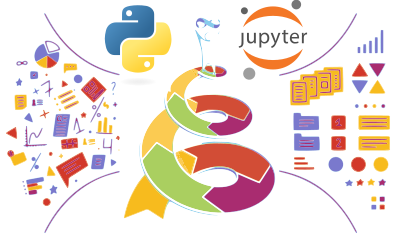

# Computational Thinking With Python

The project contains the course material for the [*Computational Thinking With Python*](https://github.com/Konczer/ComputationalThinkingWithPython) Seminar in [Engame Academy](https://engame.hu/en/) held in 2025.

## Description: 

This seminar is first and foremost about computational thinking—a practical, heuristic approach to modelling real-world problems using mathematics, computation, and data analysis. We will tackle open-ended questions, build simplified models, work with real or generated data, and critically interpret the results. Topics range from mathematics to poetry, and include prediction, optimisation, visualisation, and the use of open-source tools like Python, Jupyter, and GitHub. Students will choose and complete a Final Project based on their own interests. Ideal for students curious about STEM and for anyone with some background or affinity for programming, this course offers a hands-on introduction to data science, machine learning, and solving open-ended problems computationally.

## Weekly schedule: 

- **Session 1**: Getting Started
    - Introduction to the seminar and core tools. Students set up GitHub accounts, Python virtual environments, and write their first "Hello World" program in a simple GUI.

- **Session 2**: Tools, Resources & Complexity
    - We explore online coding and learning platforms (LeetCode, W3Schools, Wolfram blogs, etc.) for inspiration and skill-building. Introduction to computational complexity, Big-O notation, and using Google Colab for notebook-based computation.

- **Session 3**: Generative AI & Prompting
    - We dive into AI tools like ChatGPT, Claude, Gemini, and GitHub Copilot. Students learn about prompt engineering, the basics of transformer models, and discuss topics related to AI consequences, safety and alignment.

- **Session 4**: Mathematics & Synthetic data
    - Students submit a working project title and short description for the Final Project. We walk through a complete modelling cycle using Monte Carlo integration in Python, with a hands-on Jupyter notebook demo.

- **Session 5**: Physical chemistry & modelling Real Data
    - A real-world case from physical chemistry is used to demonstrate data modelling and nonlinear fitting. Students compete in a prediction challenge based on experimental results—with a reward for the closest estimate.

- **Session 6**: Computational Poetry & ML Basics
    - We explore machine learning by creating a simple author-guessing AI and compare its performance with large language models. 
    - Final project topics are confirmed
    - Students receive help during an extra online open hour.

- **Session 7**: Project Presentations
    - Students present their Final Projects. A peer and seminar leader-reviewed contest highlights outstanding works, with selected projects published as technical blog posts.

## Author

* **József Konczer** - *Seminar leader, Creator of the Syllabus* - [Konczer](https://github.com/Konczer)

## License

This project is licensed under the MIT License - see the [LICENSE.md](LICENSE.md) file for details

## Acknowledgments

* First of all for all contributing staff in [Engame Academy](https://engame.hu/en/):
	* [Peter Klausz](https://www.linkedin.com/in/peter-klausz/) for suggesting the Seminar.
* [Anita Lilla Verő](https://www.linkedin.com/in/anita-lilla-vero/) for her continuous support and also for her technical help and suggestions.
* [Krisztián Gergely](https://github.com/krisoft) for initial Scraping for Computational Poetry (originally Natural Poetry Processing).
